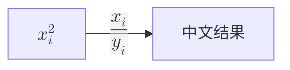
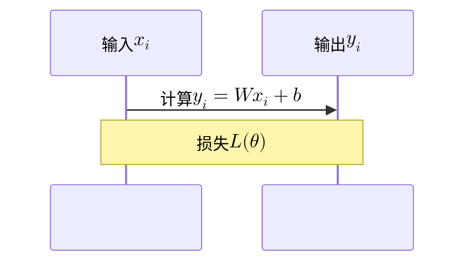

# Markdown 渲染验收样本

这份文档用于阅境轩的组合语法回归，不作为产品说明。

## 中文行内公式 $\mathcal{L}(\theta)$

当$x_i^2$收敛时，误差为\(\epsilon\)，价格 `$5` 不应被识别为公式。

## 多行公式

\[
f(x) = \begin{cases}
x^2, & x \ge 0 \\
-x, & x < 0
\end{cases}
\]

$$
A = \begin{bmatrix}
1 & 2 \\
3 & 4
\end{bmatrix}
$$

## 组合容器

| 场景 | 结果 |
| --- | --- |
| 行内公式 | $\lVert x\rVert_2$ |
| Wiki 链接 | [[top_design\|顶层设计]] |

> [!TIP]- 当 $\alpha > 0$ 时
> 可以使用 ==衰减系数 $\alpha$== 控制更新速度。

- [x] GFM 任务列表
- [ ] 脚注中的公式[^math]

[^math]: 脚注内容 $e^{i\pi}+1=0$。

## Mermaid 节点与边标签公式





## 代码保护

~~~~markdown
正文 \(x_i\) 与 ![[images/demo.png|300x180]] 在代码中必须保持原样。
```js
const price = "$5"
```
~~~~

行内代码 ``\(z_i\) and `tick` `` 也不能进入公式渲染。

## 安全 HTML

<details open><summary>允许的折叠内容</summary><kbd>⌘K</kbd></details>

<script>这段脚本必须被清除</script>
