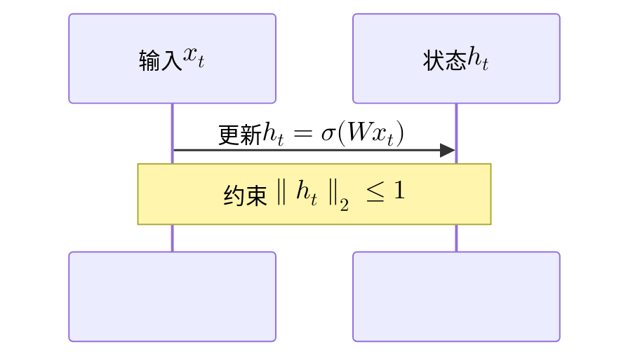

# Markdown、数学公式与 Mermaid 渲染重构方案

> 日期：2026-09-10
> 状态：实施中（A、B 与首批 C/E 已落地）
> 依据：当前 main（8807feb）、现有阅境轩/书架/PDF 设计、本地依赖实际源码与官方文档。
> 目标：补齐 Markdown 和数学表达能力，统一语法与交互，并保留现有阅读专项优化。

## 1. 交付目标与范围

将阅境轩升级为可验证的 CommonMark + GFM + Obsidian 常用语法阅读器，使公式在正文、标题、列表、表格、引用、Callout、脚注及 Mermaid 支持的标签位置正确显示。

“完整支持”按明确的语法清单验收：每一种声明支持的语法都需要覆盖组合场景、错误场景和手机端显示；不能用“引入了某个库”代替验收。

范围包括阅境轩、路径预览弹窗，以及最后阶段对时光机和 Wiki 现有渲染入口的统一。任务中枢当前的纯文本字段不在本轮自动改为富文本。书架数据、任务数据及文件内容无需迁移。

边界：

- 网页公式引擎支持的是 TeX/LaTeX 数学语法。任意 LaTeX 文档、任意宏包、TikZ、文档类、文件读写和外部命令不属于本轮“完整支持”。MathJax 同样不是完整 TeX 编译器。[MathJax 官方说明](https://docs.mathjax.org/en/latest/input/tex/differences.html)
- Mermaid 的普通图形支持以项目锁定版本为准。其官方公式保证范围目前为流程图与时序图，使用 `$$...$$`。其他图种的公式需要逐种验证或独立适配，不能宣称天然全部支持。[Mermaid 公式文档](https://mermaid.js.org/config/math)
- Dataview、Templater 等插件的查询/脚本不执行；代码块保留原文，并说明需要对应插件。渲染兼容不意味着运行 Obsidian 插件。
- PDF 继续使用现有 pdf.js 阅读器；本方案不会把 PDF 转成 Markdown。

## 2. 本轮核验得到的具体问题

本轮对当前 `useMarkdownRender.ts` 的纯字符串渲染路径做了内存中的诊断调用，没有修改业务代码。Vue 生命周期钩子使用空实现，未执行浏览器图表布局，因而下面区分解析复现与待浏览器验证项。

| 输入/场景 | 核验结果 | 原因或影响 |
|---|---|---|
| `当$x_i^2$收敛时` | 没有生成公式节点 | 当前数学扩展的默认边界规则不适配紧邻中文 |
| `## 损失 $L = x_i^2$` | 能生成公式，但 ID 为 `损失-lxi2l-xi2lxi2` | 用公式渲染后的 HTML 去标签生成 ID，混入 MathML、TeX annotation、视觉层文本 |
| `## 损失$L = x_i^2$函数` | 公式未识别 | 标题和正文有相同的分隔边界问题 |
| `~~~text` 内的 `\(x_i\)` | 代码内容被改成 `$x_i$` | 预处理只暂存三反引号围栏 |
| Mermaid 标签 `"$$x_i^2$$"` | 进入 Mermaid 前被改为 `"$$xᵢ²$$"` | 自定义 Unicode 替换改变了合法 TeX 源码 |
| `\[ x + % comment` 换行 `y \]` | 后续 `y` 被注释吞掉 | 将公式内实际换行压为一个空格，改变了 TeX 注释语义 |
| 图片 `![[a.png\|300]]` | 尺寸后缀被丢弃 | 现有转换仅保留图片路径 |
| 原始 HTML → `v-html` | 没有统一清洗步骤 | 原始事件属性、协议及后续字符串拼接需要集中处理 |

另外，目录从全局 DOM 查询 H1–H4；正文切换动画期间和预览弹窗同时存在时，重复标题 ID 可能导致错误定位。Mermaid 的全局配置由每个 composable 实例初始化，各实例有独立队列，仍需验证同时打开正文和预览、快速切换主题时的竞争。

现有实现值得保留的部分包括宽内容局部横滚、代码行号、图表与高亮按需加载、过期文件请求取消、事件委托、读书进度恢复，以及手机端的沉浸工具栏。

## 3. 技术路线与取舍

推荐使用 unified / remark / rehype 建立结构化渲染核心，保留 KaTeX、Mermaid、Highlight.js、panzoom 和 pdf.js 的专项能力。

| 路线 | 优点 | 本项目的代价 | 决策 |
|---|---|---|---|
| 保留 Marked，扩充 token 插件 | 迁移量小，现有输出容易保持 | 标题元数据、公式上下文、嵌入及清洗仍需自行组织 | 可行备选，但不作为主方案 |
| markdown-it + 插件 | 常用扩展丰富，token 渲染方便 | 仍需补源位置、跨文档引用与统一 HTML 处理 | 可行，当前不选 |
| unified + remark + rehype | Markdown/HTML 均有结构化语法树，便于源位置、语义转换、清洗和测试 | 依赖与中间结构更重，需要 Worker 和内存基线控制 | 推荐 |

这是一项可维护性的选择，不预设新解析器比 Marked 更快。必须先测新旧版本的解析耗时、输出体积、DOM 数量、首屏和峰值内存。

建议依赖职责：

- `remark-parse`：基础 Markdown；`remark-gfm`：表格、任务列表、自动链接、删除线及脚注。[remark-gfm](https://github.com/remarkjs/remark-gfm)
- `remark-math`：美元定界符数学节点；额外的小型 micromark/mdast 扩展处理 `\(...\)`、`\[...\]` 和本项目的定界边界规则。不能仅接入 remark-math 就宣称所有定界符和中文场景已解决。[remark-math](https://github.com/remarkjs/remark-math)
- `remark-frontmatter` 与受限 YAML 解析：识别属性，不执行或注入配置。
- `remark-rehype`、`rehype-raw`、`rehype-sanitize`：HTML 转换与不可信内容处理。
- KaTeX：默认数学排版；MathJax：按需加载的高级文档兼容模式。
- Mermaid：独立图表管线；Highlight.js：保留常用语言包，其他支持语言通过受控映射按需加载。

新依赖的具体版本在实施首阶段核对浏览器/Vite/TypeScript 兼容后锁定。不要顺带升级全部已有重型库。

## 4. 渲染架构

```text
Reader / PathPreview / Timeline / Wiki
                  │ source + context + profile
                  ▼
          MarkdownDocument / render service
                  ▼
      解析 Worker：Markdown → 结构化语法树
                  ▼
      语义分析：标题、脚注、公式、链接、嵌入
                  ▼
      安全 HTML 树 + 内部节点登记表 + 目录元数据
                  ▼
      首屏优先的块级渲染计划 → 主线程挂载
                  ▼
      数学排版 / 代码高亮 / Mermaid / 媒体加载
                  ▼
      横滚、点击放大、锚点定位、布局稳定通知
```

解析与 UI 分离。普通段落不需要一个词一个 Vue 组件；按顶层语义块输出安全 HTML，仅为公式、图表、媒体等有生命周期的内容分配控制器。

建议接口：

```ts
interface RenderContext {
  documentKey: string
  sourceVersion: string
  rootPath?: string
  filePath?: string
  profile: 'reader' | 'preview' | 'memo' | 'wiki'
  sourceFormat: 'commonmark' | 'obsidian'
  signal: AbortSignal
}

interface RenderPlan {
  blocks: RenderBlock[]
  headings: HeadingMeta[]
  references: ReferenceIndex
  diagnostics: RenderDiagnostic[]
  requiredFeatures: Set<'math' | 'diagram' | 'highlight' | 'embed'>
}
```

上述类型是设计契约，不是已存在 API。Worker 边界传递可结构化克隆的数据；`AbortSignal` 留在服务协调层，通过请求 ID 和取消消息控制 Worker，不把它作为普通数据直接跨线程发送。

生命周期必须明确区分 `parsed`、`firstPaintReady`、`visibleEnhancementsReady`、`layoutChanged`、`disposed`。现在的 `enhance()` 返回时并不代表 Mermaid、图片已经完成；进度恢复应订阅实际布局变化。

## 5. Markdown 与 Obsidian 语法契约

| 类别 | 本轮目标 | 规则 |
|---|---|---|
| 基础 Markdown | 标题 H1–H6、强调、引用、列表、链接、图片、分隔线、转义 | CommonMark 行为为基线 |
| GFM | 表格、删除线、任务列表、自动链接、脚注 | 宽表格继续局部横滚；复选框只读 |
| 代码 | 不同长度的反引号/波浪线围栏、缩进代码、多反引号行内代码 | 内部内容不参与数学/Obsidian 改写 |
| Wiki 链接 | `[[笔记]]`、别名、标题及块引用 | 使用统一文档解析器定位 |
| Callout | 常见类型、别名类型、折叠、嵌套、自定义标题 | 标题和正文均可含公式；未知类型用中性色 |
| 高亮与注释 | `==...==`、`%%...%%` | 只在对应语法上下文生效，代码与公式中的 `%` 保持原样 |
| 脚注 | 命名/数字脚注、多行脚注、重复引用、Obsidian 行内脚注 | 编号/回链稳定，脚注内容可含公式 |
| 块引用 | `^block-id` 与 `#^block-id` | 隐藏标记文本，保留可定位目标 |
| 属性 | YAML Frontmatter | 默认收起为可展开属性区；不把属性当代码执行 |
| 定义列表 | 术语 + `: 定义` | 作为明确启用的扩展，不误判普通冒号段落 |
| HTML | table、details、summary、kbd、sub、sup 等常用安全元素 | 标签、属性、链接经过白名单 |
| 图片 | Markdown/Obsidian 路径、大小、alt、title | 明确尺寸优先但不超出可读区域 |
| 笔记嵌入 | 整篇、某章节、某块 | 懒展开/懒渲染、循环检测、资源预算 |
| PDF/音视频嵌入 | 文件卡片及按需预览 | 用户点击后加载重资源，不自动播放 |
| 插件代码块 | Dataview/Templater 等 | 显示源码与简短提示，不执行 |

Obsidian 常用语法参考其官方说明，本项目会把支持项逐一转换为固定测试样例，扩展优先级独立测试。[格式语法](https://help.obsidian.md/syntax)、[Callout](https://help.obsidian.md/callouts)、[文件嵌入](https://help.obsidian.md/embeds)

单换行沿用页面已有语义：Reader/Preview 采用 Markdown 软换行；Memo 保留当前小记单换行的视觉效果。该差异是 profile 配置，不再维护两套解析代码。

## 6. 数学公式：识别、语义与排版

### 6.1 定界符与组合位置

支持以下正文：

```markdown
当$x_i^2$收敛时，误差为\(\epsilon\)。

## 损失函数 $\mathcal{L}(\theta)$

| 指标 | 公式 |
| --- | --- |
| 范数 | $\lVert x\rVert_2$ |

> [!TIP] 当 $\alpha > 0$ 时
> 学习率可以逐步衰减。

$$
\begin{aligned}
h_t &= \sigma(Wx_t + Uh_{t-1}) \\
y_t &= Vh_t
\end{aligned}
$$
```

规则：

1. `$...$`、`\(...\)`是行内公式，不要求中文前后补空格。
2. 独占块的 `$$...$$`、`\[...\]` 是块公式；支持起止同一行和多行。
3. 标题、表格单元格等仅容纳行内内容的位置，兼容成对 `$$...$$` 的行内数学节点，禁止插入块元素破坏容器结构。真正多行块公式不跨越表格行或标题行。
4. 显式 `math` 围栏可以作为公式块；`latex`/`tex` 围栏默认仍是源码，避免把演示代码错误执行为公式。
5. `\$` 保持字面量。货币样例 `$5`、`价格 $5 和 $10` 不误识别；通过定界符位置、空白及结束符后数字等规则约束。遇到无法消歧的文本，以显式 `\(...\)` 表达数学，规则写入手册。
6. 反斜杠、花括号、`\\`、`&`、换行、`%` 注释都原样保留；仅做保留源位置映射的 BOM/行尾标准化。
7. 表格中的裸 `|` 仍遵循 GFM 分列语义；公式用 `\lvert` / `\rvert` 或经测试的 `\|` 转义，不全局吞掉表格分隔符。
8. 公式节点先于 Markdown 转义被识别，不在渲染后的 HTML 中搜索 `$`。

### 6.2 KaTeX 与高级兼容模式

默认使用 KaTeX：行内数学、分数、根式、求和积分、矩阵、分段函数、aligned 等以其支持清单为基线。[KaTeX 支持表](https://katex.org/docs/support_table)

正文高级数学模式使用按需加载的 MathJax，目标覆盖其白名单 TeX 扩展、公式自动编号及 `\label` / `\ref` / `\eqref`。明确规则：

- 文档分析阶段确定所需引擎；文档级编号/交叉引用由单一引擎统一处理，不在同一文档内随机混用两套编号。
- 默认 KaTeX；发现明确需要高级功能或已验证的兼容性缺口时选择 MathJax。不是所有语法错误都自动触发第二个引擎。
- 若渲染阶段才发现可兼容的不支持命令，最多升级一次文档数学模式；语法错误则局部显示问题，避免反复重试。
- 普通 Markdown 文档不加载数学 JS；含普通公式的文档不加载 MathJax。字体与扩展全部随产品构建，不依赖在线 CDN。
- KaTeX / MathJax 渲染结果的基线、颜色和缩放分别校准；不同引擎不承诺像素完全一致。
- Mermaid 原生数学仍使用其自己的 KaTeX 路径。正文 MathJax 的高级功能不会自动传入 Mermaid。

### 6.3 宏、编号与错误隔离

- 为每个文档创建独立数学上下文，同一篇中的合法宏按源顺序处理；A 文档的 `\gdef` 不能影响 B 文档。
- 第一版宏定义块在文档内按顺序解析并生成上下文快照；公式懒渲染也不能因滚动顺序不同而改变结果。对于无法可靠提取的复杂 TeX 状态，将该文档交给 MathJax 的顺序排版流程。
- 缓存 key 必须包括宏上下文版本和引擎版本；MathJax 的文档级引用/编号结果不当作跨文档独立公式缓存。
- 保留用户的显式 `\tag{...}`；自动编号和引用不依赖公式进入可视区域的先后。
- KaTeX 设置 `trust: false`，限制宏展开次数和用户给定的尺寸；使用容器级 try/catch 捕获错误，正常内容继续显示。[KaTeX 配置](https://katex.org/docs/options)
- 公式错误显示可选择的原文和简短说明，提供查看源码/复制源码；不自动改写数学表达式来“猜测修复”。

## 7. 标题公式、目录和锚点

标题必须分离三个结果：

| 数据 | 用途 | 生成方式 |
|---|---|---|
| `inlineNodes` | 正文标题及目录显示 | 原始标题解析得到的文字/强调/数学节点 |
| `plainLabel` | 无障碍名称、文本搜索、tooltip | 从原始节点生成一次；公式采用可读简化表示或单份 TeX |
| `anchorKey` | 稳定跳转 | 规范化文字 + 原始公式文本 + 同名计数，不依赖渲染 HTML |

目录默认支持 H1–H6，并可延续默认显示到 H4 的层级设置。目录中的行内公式使用同一数学服务与缓存，只处理可见目录项；过长条目截断时仍可查看完整标题。

锚点采用“外部逻辑名称 → 当前文档 DOM ID”映射。DOM ID 加实例命名空间，正文、离场动画、弹窗、嵌入笔记互不冲突。元素查询限定在当前文档容器，不再用全局 `document.getElementById`。

保留已有常规标题 slug 的解析兼容；数学标题旧 slug 在可确定的情况下加入别名映射。目录、脚注、显式 HTML 锚点、块引用和跨文件标题跳转共用解析规则，并与 sanitizer 的 ID 前缀一致。无匹配或多义时给出可理解的定位反馈。

跳转先确保目标块已挂载，再滚动；未渲染的图表不能使目录跳转停在错误高度。沿用程序化滚动期间的手机端顶部栏锁定。

## 8. Mermaid：公式与图表共同排版

### 8.1 第一批必须通过的场景

以下为示例输入，最终以浏览器实际排版验收：

````markdown



````

验收覆盖：流程图节点/边标签、时序图参与者/消息/Note；中文与公式混排；分数、上下标、矩阵；三种主题；手机、桌面与放大查看。

移除对引号内 `_`、`^` 的无条件 Unicode 改写。保留原始源码用于复制和报错；未标记为数学的 `file_name` 等标签按字面文本显示。

Mermaid 内原生 `$$...$$` 为标准写法。额外兼容 `$...$`、`\(...\)` 只在已解析出的可见标签字段中转换，不对整个 Mermaid 源码替换，节点 ID、箭头语法、URL、样式、注释不受影响。若该图种没有可靠标签解析器，使用原生写法并返回定界提示。

不把正文宏表直接注入 Mermaid。第一批保证内置数学命令及每个标签中独立成立的 TeX；跨标签/跨正文共享宏作为显式扩展，需要 TeX 级预展开和独立测试后才纳入。这里存在真实的上游接口边界。

### 8.2 字体、布局与查看器

- 推荐在锁定版本验证后使用 `forceLegacyMathML: true`，复用项目 KaTeX CSS 与字体，降低跨平台 MathML 差异。[Mermaid 跨浏览器配置](https://mermaid.js.org/config/math)
- 渲染前等待该图表需要的字体可用；测量容器必须已连接且有有效宽度，不能在 `display: none` 中计算。
- 公式尺寸必须参与 Mermaid 布局；不能在图已经布局完成后盲目替换 SVG 文本，否则节点边界和连线会失配。
- 初始展示使用静态占位卡，不先闪出源码再跳成图表；成功后通知外层重新计算横向溢出和阅读锚点。
- 保留 SVG 放大、拖动、双指缩放、复位、Esc 与手机关闭按钮。显示实例使用独立 SVG ID，并同步重写 marker/clipPath/引用关系，避免复制 SVG 后冲突。
- 查看器接受受控的 diagram/image 数据，不把图片 src/alt 重新拼成未经转义的 HTML。
- 普通图片保持当前照片居中和宽度上限；图表按自己的可读性策略适宽，不套用照片的 480px 上限。

### 8.3 调度与失败行为

- 整个应用共享一个 Mermaid 调度器，正文、弹窗和小记共享串行队列；配置初始化和渲染在同一受控任务中。
- 任务包含文档版本、块 ID、主题、宽度；每次完成验证版本后再提交。
- 可视及即将可视内容优先，保留现有提前渲染缓冲区；切主题只更新当前可见图，其他图在再次可见时更新。
- 待执行任务可以取消；已进入 Mermaid 的同步布局不能靠 Promise 超时强制停止。设置源码/节点/边数量预算以控制极端输入，完成后的过期输出丢弃。
- 建议初始自动渲染预算为 50KB 源码、500 条边，最终按基准调整。超预算展示完整源码与“尝试渲染”入口，不静默截断。
- 单图失败保留原文、错误摘要及重试，不把引擎错误 SVG 当作成功图表；主题切换失败时保留上一张有效图。
- 安全模式以 `strict` 为目标；测试包含公式和 HTML 标签兼容。用户 diagram 配置不能覆盖安全选项、加载远程代码或注册回调。

其他图种保持普通图形支持。建立 `diagram type × label position × math capability` 清单；若数学不受支持，图保持原结构并展示明确说明/公式原文。通用全图种数学扩展需要能访问布局前的标签测量接口，单独估算，不能隐藏为第一批已完成项。

## 9. 链接、附件与嵌入

统一 `resolveDocumentTarget()` 返回结构化结果：文档、锚点、图片、PDF、音视频、目录、外部链接、不存在、多义或被拒绝。

路径处理：

1. 明确区分 URL 协议、`//` 网络链接、POSIX 绝对路径、Windows 盘符/UNC 路径及相对路径；前端不再假设服务器总在 macOS。
2. 普通 Markdown 链接相对当前笔记目录。Wiki 链接先匹配明确根目录相对路径、当前目录相对路径，再匹配根范围内唯一的短路径/文件名；同名冲突由候选选择解决，不随机取第一项。
3. 对大小写采用服务器文件系统语义，保留原始规范路径，不能统一转小写；`%`、空格、中文、`#`、`?`按链接语法安全解码一次。
4. 索引范围默认为当前打开目录。它不一定是 Vault 根目录，不能宣称全 Vault 解析一致；缺失或重名时显示范围说明。
5. 现有文件树默认深度 10。短路径索引须记录完整性，按需补读子目录或使用只读定向解析接口；不能把没扫描到的附件直接判定为不存在。
6. root/版本变化使索引和缓存失效；文件内容引用经过规范化路径去重。跨平台 canonical path、MIME 及存在性判断以服务端为准。

图片支持 `![[a.png|300]]`、`![[a.png|300x200]]` 和相应 Markdown 图片尺寸形式。未指定尺寸保留当前默认样式；指定尺寸仍限制在容器内，并明确宽高同时指定时的缩放/留白规则，防止拉伸。

媒体保持响应式宽度，懒加载、无自动播放。PDF 初始显示文件卡片/指定页提示，点击调用现有阅读器或单个按需预览实例；不能每个 PDF 嵌入都立刻初始化完整 pdf.js。

笔记嵌入递归调用同一个语法核心，嵌入中的相对资源按被嵌入文件解析。初始建议上限：深度 3、单文档自动展开 20 项、累计嵌入源码 2MiB；超过预算保留可打开的引用卡片。用 canonical path + fragment 检测循环，重复合法引用允许显示但数据读取复用。

必要后端改动限制在只读路径解析、资源元数据/版本与媒体 MIME。继续复用现有文件读取及 Range 流式传输，不改书架存储和 PDF 清晰度策略。

## 10. HTML 安全与公式保真

顺序必须是：不可信 Markdown/原始 HTML → HTML 树清洗 → 受控数学/代码输出。默认 sanitizer 会破坏数学生成的复杂结构，因此不能在最后直接套一个默认清洗器；官方给出的数学处理示例同样强调顺序。[rehype-sanitize 的数学说明](https://github.com/rehypejs/rehype-sanitize#example-math)

具体要求：

- 清除事件属性、危险协议、脚本、任意 CSS 注入、危险 object/embed。保留安全 HTML 表格（含 colspan/rowspan）、details、kbd、上下标等。
- Markdown 链接、图片、raw HTML 的 src/href/srcset、媒体 source 统一执行 URI 规则；`javascript:`、可执行 data URL 不可到达 DOM。
- 原始 iframe 默认显示链接卡；需要支持的可信媒体采用单独受限组件，不透传任意 iframe 属性。
- 数学/图表占位节点由内部登记表识别，不信任文档伪造的 class 或 `data-*`；源 HTML 不可伪装成内部已验证输出。
- KaTeX 输出来自限制配置的排版器；后续插件不允许添加未转义的不可信 HTML。
- Mermaid 输出独立执行 SVG/MathML/foreignObject 专用策略，保留必要的公式结构、命名空间与受限样式；其政策与 raw HTML 不混用。具体实现选择 DOMPurify 独立实例或等价的专用清洗器，需浏览器结构测试证明保真。
- Mermaid 的 themeCSS、回调和外链按可信配置白名单处理；生成样式局限在本图 ID 下，不能影响应用外壳。
- Reader、预览、图片查看器与错误卡片执行相同的安全数据约束，不能只保护主文档入口。

这是本轮实际存在的渲染链问题。服务全局监听地址/CORS 属于独立配置议题，不借本轮改变手机通过局域网访问的部署方式。

## 11. 保留现有专项优化的映射

| 现有能力 | 重构承接位置 | 不回退的验收 |
|---|---|---|
| GFM/raw HTML 宽表格滚动 | HTML 转换器 + OverflowController | 最右单元格可达，正文无整体横滚 |
| 宽代码与行号 | CodeBlock renderer | 不自动折行、行号对齐、复制不含行号 |
| 公式局部横滚 | MathBlock | 左右两端和编号均可达 |
| 图表/代码可视区增强 | 全局调度器 | 首屏不等待所有图表，高亮/图表按需加载 |
| 图片适宽、居中、点击放大 | ImageBlock + Viewer | 照片不异常放大，小图不强行拉伸 |
| Mermaid 放大与触摸交互 | DiagramBlock + 当前查看器 | 双指/拖动/复位/关闭正常，公式一起缩放 |
| 文件请求 Abort + 版本门控 | RenderSession | 快速切文档不串内容 |
| 主题切换 | CSS token + 按需 diagram 更新 | 普通正文/KaTeX不全篇重排，护眼主题有对应图表配色 |
| 横滚边缘提示和键盘操作 | OverflowController | 加载后/放大后/窄屏切换后状态准确 |
| 事件委托与释放 | MarkdownDocument 生命周期 | 监听器和 Observer 不随阅读次数累积 |
| 全屏标题玻璃、翻页过渡 | Reader 外壳 + 稳定标题契约 | 公式标题不被固定高度裁掉 |
| 目录和阅读进度 | HeadingIndex + AnchorController | 预览/重复标题不误跳，原进度仍可恢复 |
| 手机工具栏和滚动边界 | 当前 Reader 外壳 | 空文档可选文件，工具栏显示逻辑及底部无空白回归 |
| PDF 清晰度/像素预算/Range | 现有 PdfViewer | MD/PDF 切换、DPR、内存回收不回退 |

## 12. 性能设计

### 12.1 计算与挂载

- 解析、语义分析、适合纯计算的高亮/数学排版移入 Worker；DOM 测量、Mermaid 布局、查看器仍在主线程。
- 第一版保持完整语义分析，避免把跨段脚注/链接引用/列表按空行切坏；Worker 输出紧凑的块计划，AST 不长期留在主线程。
- 只有一份主要源码与必要的块元数据；不要同时缓存原文、AST、全量 HTML、全部图表 SVG 的无限多文档副本。Worker 在替换文档和长期空闲后清理。
- 普通文档立即挂载；大文档按顶层安全边界分批挂载，首屏优先，每帧工作目标 4–8ms，超过预算让出主线程。Worker 无法自动解决巨量 DOM 的挂载成本。
- 先保留已挂载正文，确保浏览器查找、文本选择、复制和锚点可用；不默认卸载所有视口外正文。
- `content-visibility` 仅作为后续经过 sticky 标题、查找和高度测试的可选优化；不直接在整篇 article 上增加 layout/paint containment。

### 12.2 懒加载与缓存

- 数学、图表和额外高亮语言按实际需要加载；重依赖不得进入所有路由的首屏包。
- 图片首屏优先，其余原生懒加载，异步解码；有显式尺寸或元数据时预留比例。仅有 CSS `max-width` 不会减少原图解码内存，超大照片的缩略图/分辨率变体按独立测量决定是否增加后端接口。
- Mermaid 使用共享串行队列；显示过的 SVG 有严格的缓存上限，不能因“访问过”永久保留每篇全文 DOM。
- 公式缓存 key 包括源码、模式、引擎版本、宏环境、相关样式版本；图表缓存还包括主题、布局配置、宽度及字体版本。
- 图表 SVG 挂载时命名空间隔离。缓存不保存 DOM 元素、事件闭包或正在使用的 panzoom 实例。
- 建议初始缓存预算：手机公式/图表序列化缓存合计 8MiB、桌面 24MiB，同时限制条数；这是缓存预算，不是浏览器总内存承诺。
- 文件缓存以内容 hash 或可靠版本键失效；媒体版本化 URL 避免同路径换图仍显示旧缓存。保留 DOM 只读状态不等于保证浏览器立即释放图片解码缓存。

### 12.3 滚动与进度稳定

沿用每文件进度数据。增加可选的 block key + 块内偏移，旧的滚动比例作为兼容回退；文档版本不一致时回退到标题/比例，不跳到已失效的节点。

图片、公式、Mermaid 或嵌入展开时，以当前可见阅读锚点保持位置；只补偿视口上方高度变化，用户正在滚动/选择文本时优先尊重输入。恢复过程采用受控的稳定窗口，不持续强制拉回进度。

Observer 更新按帧合并，增强完成显式触发溢出重算；不能只依赖容器 ResizeObserver，因为内部 scrollWidth 改变时容器边框尺寸可能不变。

## 13. 视觉与手机端验收原则

沿用当前浅色、深色、护眼主题及圆角/玻璃外壳。正文为阅读内容，避免给每个元素都增加玻璃层或入场动画。

- 行内公式跟随文字基线，避免改变整段行高；高分数允许自然增高，不能裁切。
- 标题中的公式跟随字号，复杂上下标不被标题 line-height 或 sticky 容器截断。
- 块公式和表格保留自身完整结构，手机优先局部横滚；过长公式可点开查看器，不能缩到无法辨认。
- 公式编号固定在自己的布局区域，横滚/小屏下不盖住数学内容。
- Callout 使用现有圆角和主题色，折叠箭头和标题共同构成可点击区域；键盘可展开，支持 reduced-motion。
- 不为每个行内公式常驻按钮；复制 TeX/查看大图在选中、聚焦或查看器内呈现，手机不依赖 hover。
- 图表卡片、错误卡片、附件卡片统一间距、字体和状态反馈。加载完成只局部短淡入，不对整篇文档使用交错弹入。
- 对 SVG、MathML、KaTeX 的全局 CSS 单独检查：普通 Markdown 的 `code`、`img`、`svg` 样式不能误作用于数学排版内部。

## 14. 文件组织与迁移接口

```text
frontend/src/markdown/
  types.ts / profiles.ts
  parser.ts / markdown.worker.ts
  syntax/             数学定界符、Obsidian 扩展
  transforms/         标题、脚注、Callout、链接与嵌入
  security/           HTML、URI 与 SVG 策略
  math/               引擎适配、文档宏/编号、缓存
  diagram/            Mermaid 配置、标签、队列、能力矩阵
  runtime/            会话、取消、分批挂载、布局通知
  resources/          文件解析、版本、嵌入预算

frontend/src/components/markdown/
  MarkdownDocument.vue
  MathBlock.vue / DiagramBlock.vue / MediaEmbed.vue
  RenderErrorBlock.vue

frontend/src/styles/markdown.css
frontend/tests/markdown/fixtures/
frontend/tests/markdown/*.test.ts
frontend/tests/e2e/markdown*.spec.ts
```

目录表达职责边界，小工具可合并，不要求每个概念都建一个类。

`useMarkdownRender` 在迁移期作为适配入口：先支持安全解析结果与目录元数据，再迁移到异步 RenderSession。所有调用点同时审查生命周期。Reader 继续拥有当前文件、路由、全屏、书架及阅读进度；解析器不引用 app store。

Markdown 样式从 Reader.vue 的全局 style 中抽取到独立样式文件；主题高亮 token 统一管理，移除时光机固定 github-dark 样式的潜在覆盖。预览从任何入口打开都具备完整样式，不依赖先访问 Reader。

纯解析测试继续使用 Node；确需 Vue 生命周期的测试再引入合适运行器。当前 `node --test tests/*.test.ts` 不会自动覆盖新嵌套目录，必须同步更新测试发现规则。布局、字体、交互使用浏览器端测试，不能仅用字符串包含断言证明渲染正确。

## 15. 实施阶段与可评审交付

| 阶段 | 主要工作 | 验收门槛 |
|---|---|---|
| A：基线与兼容试验 | 建立真实缺陷 fixtures；记录旧版视觉/性能；核对候选依赖及 Mermaid strict + 公式排版 | 重现本方案第 2 节问题，形成明确失败用例；版本可构建 |
| B：语法核心与安全基础 | 新 parser、数学定界符、标题元数据、HTML/URI 清洗、受控输出；抽离样式 | 普通 Markdown、公式标题、代码保护及 HTML 表格通过；未迁移入口不绕过安全边界 |
| C：公式与 Mermaid | KaTeX 完整矩阵、宏隔离、标题目录、MathJax高级模式、图表公式和全局队列 | 核心数学样例及所有列明图表标签位置在桌面/手机通过 |
| D：Obsidian 与资源 | Wikilink、Callout、高亮、注释、脚注、块引用、附件尺寸、笔记/媒体嵌入 | 根路径/同名/循环/Windows 场景通过；嵌入有预算 |
| E：Reader/Preview 与性能 | RenderSession、Worker、分批挂载、取消、缓存和进度稳定 | 专项优化映射全部回归；性能指标满足约定 |
| F：统一其他入口 | Timeline/Wiki profile 迁移，保留小记换行、搜索高亮和图片网格；删除旧正则渲染 | 同语法的内容含义一致，小记图片不重复，搜索高亮不破坏代码/公式 |
| G：收尾与手册 | 删除旧 Marked 路径及冗余依赖，整理样本/报告，更新官网支持说明 | 无旧渲染入口，检查/构建通过，公开支持清单与实测一致 |

每阶段单独评审/提交。迁移期间的切换开关仅供开发验证；普通使用每篇文档只启用一个渲染器，不双份挂载。遇到新渲染失败显示安全源码，不自动退回旧的未清洗 HTML 路径。提交行为在用户要求时执行。

优先交付 B+C 中的中文行内公式、公式标题、数学源码保真及 Mermaid 公式；高级数学和资源系统是独立验收项，不能因此拖延这些最直接的阅读修复。每项存在依赖时按表格阶段顺序落地。

## 16. 验收样本与测试方法

至少保留以下类别的固定输入、语义断言与代表性截图：

| 样本 | 必须验证 |
|---|---|
| 中文/英文紧邻公式 | 数学被识别；货币、转义美元不误判 |
| H1–H6 数学标题 | 标题、目录各只呈现一份公式，ID 与引擎/主题无关 |
| 同名标题/预览/嵌入 | DOM ID 不重复，逻辑锚点进入正确文档 |
| 表格/Callout/脚注公式 | 嵌套结构正确，公式不会成为额外列或脱离容器 |
| aligned/cases/matrix/注释 | `\\`、`&`、换行和 `%` 语义保留 |
| 宏与引用 | 同文档有效、跨文档隔离，滚动顺序不影响结果 |
| 高级公式模式 | 编号/前向引用/重复 label 的约定成立，不反复重排 |
| 三/四/多反引号、波浪线、缩进代码 | `$`、`\(`、`![[...]]` 完全保持源码 |
| Mermaid 普通标签/数学标签 | `file_name` 原样；节点、边、消息、Note 公式正确 |
| Mermaid 复杂公式 | 图形包住公式，连线位置正确，无盒内裁切 |
| Mermaid 无效源码/不支持图种公式 | 正文可继续阅读，原文可复制，失败不污染下一图 |
| 标准与 HTML 宽表格 | 最左/最右内容、合并单元格均可见 |
| 图片、媒体、附件路径 | 相对/绝对/编码/短路径/同名/404反馈正确 |
| 循环或大量嵌入 | 资源预算生效，主文档不被阻塞 |
| HTML/URI攻击输入 | 不执行事件/危险链接，正常公式和 SVG 仍显示 |
| 窄屏与主题 | 320/390/430/768/1440px，浅/深/护眼，高DPR下可读 |
| 生命周期 | A→B→A、快速切换、主题切换、关闭预览无陈旧输出 |
| 阅读交互 | 横滚、全屏、图片/图表放大、回到进度、文字选择、浏览器查找 |

验证层级：纯语法与资源解析单测；带真实字体的浏览器结构/截图测试；整个 Reader 路径的端到端测试；独立性能基准。

浏览器至少覆盖 Chromium、Firefox、WebKit。WebKit 自动化不能代替真机 iOS Safari；手机实机与 Windows 路径实际服务端分别记录验证结果，未测试的平台标记“待实机验证”。

本轮方案仅执行了第 2 节的解析诊断，没有执行新方案的 UI/性能基准。

## 17. 性能验收目标与测量口径

先在相同机器、相同 production build、相同语料及相同浏览器下测旧版。以下是初始目标，不是已经取得的测试结果：

| 场景 | 初始目标 |
|---|---|
| 100KiB普通 Markdown，依赖已加载 | 从源码就绪到首屏可读 P95：桌面 ≤200ms，代表性手机 ≤400ms |
| 普通文档相对旧版 | 首屏 P95、滚动响应不退化超过 10%；超出需定位与修正 |
| 1MiB 混合长文 | 首屏可读不等待末尾图表；普通分批挂载尽量避免 >50ms 长任务 |
| 复杂 Mermaid | 单独记录首图/后续图耗时与长任务；不能把其同步布局时间排除后宣称全程无卡顿 |
| 首次冷加载 | 单列 JS/CSS/字体下载与初始化耗时，不与暖缓存混报 |
| 20篇混合文档反复切换 | 资源稳定后 JS heap 与 DOM/Observer 不持续线性增长；相对热身后空闲基线保留堆增长目标 ≤10% |
| 图表/公式缓存 | 达到 8MiB/24MiB建议预算时能淘汰；缓存条数同步受限 |
| 阅读恢复 | 旧比例记录兼容，固定样例在布局稳定后误差 ≤2%；锚点恢复以当前阅读块为准 |
| 资源密集页面 | 分别记录 JS heap、DOM、图片解码与浏览器进程内存；不能只看 JS heap 判断原来的 500MB 问题 |

至少 20 次采样报告中位数/P95；泄漏回归结合自动化环境可控 GC 与真实使用两种口径。先热身所有本轮会用到的引擎，避免把首次模块加载误判为泄漏。大图/大 PDF 的解码或 canvas 内存单列，不能承诺任意文档始终低于固定浏览器总内存。

渲染正确性和当前专项体验是门槛；新功能通过后再确认性能指标。不得用将字体缩小、截断正文、禁用公式或移除图表的方式换取达标。

## 18. 完成定义

完成时交付：统一渲染核心与资源解析服务、迁移后的页面入口、可复用的阅读组件/样式、语法样本库、浏览器验收结果、性能对比报告，以及官网手册中的准确支持清单。

代码完成后执行前端测试与构建；涉及只读资源后端变更时执行对应测试，并在提交前满足项目要求的 Rust fmt、clippy、cargo test。若出现已有失败，应注明具体失败及影响，不把未通过的检查写成已通过。

### 18.1 2026-09-10 首批实施记录

已完成：

- 以 unified / remark / rehype 替换 Marked 字符串拼接管线，HTML 在数学排版前经过结构化清洗。
- 支持中文紧邻的 `$...$`、`\(...\)`、`$$...$$`、`\[...\]`、`math` 围栏及标题/表格/Callout/脚注内公式；保留 TeX 换行和注释语义，隔离每篇文档的宏状态。
- 支持 GFM 表格、任务列表、删除线和脚注，以及 Obsidian Wiki 链接、图片嵌入尺寸、高亮、注释、Callout 和块引用锚点。
- Mermaid 保留原始 TeX，不再转成 Unicode 上下标；流程图节点/边与时序图参与者/消息/Note 的 `$$...$$` 已通过真实浏览器验证。
- 标题建立语义标签、稳定逻辑锚点与文档级 DOM 命名空间；目录支持 H1–H6 并复用标题中的公式排版，查询限定到当前正文/预览容器。
- Markdown 解析和 KaTeX 排版移入可取消的 Web Worker；代码高亮与 Mermaid 继续按可见区域懒加载，重型解析核心不进入 Reader 主线程包。
- 保留代码行号、表格/代码/块公式横向滚动、图片与 Mermaid 查看器、主题切换、阅读进度及快速切换文件的过期结果丢弃逻辑。
- 新增组合语法 fixture 与 16 项渲染核心回归测试；前端全量 158 项测试、TypeScript 和生产构建通过。

后续阶段仍包括：MathJax 高级编号/交叉引用模式、非图片笔记嵌入与完整资源歧义解析、超大文档分批挂载/有界缓存、Timeline/Wiki 入口统一，以及独立设备性能对比报告。这些能力不包含在首批已完成声明中。
